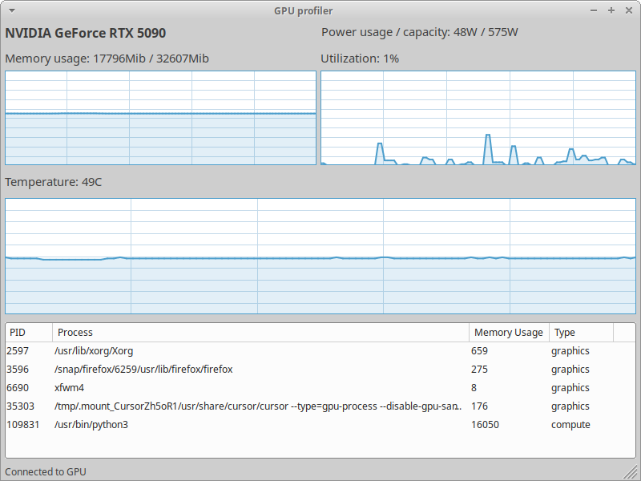

# GPU Profiler (wxWidgets + NVML)

A simple desktop application for Linux (XFCE/GNOME) to monitor NVIDIA GPU usage, memory, temperature, power, and running GPU processes in real time.  
Built with C++, wxWidgets, CMake, and NVIDIA Management Library (NVML).

## Features

- **Real-time GPU Monitoring:**  
  - GPU name, utilization, memory usage, temperature, and power usage.
  - Timeline charts for memory, utilization, and temperature (like Task Manager).
- **Process List:**  
  - Shows all processes using the GPU (compute/graphics/both).
  - Efficiently updates with minimal flicker.
- **Cross-Desktop:**  
  - Works on XFCE, GNOME, and other Linux desktops (uses GTK via wxWidgets).

## Screenshots

## Build & Run

### Prerequisites

- Linux with NVIDIA GPU and proprietary driver
- `libnvidia-ml-dev` (NVML)
- wxWidgets 3.x (GTK)
- GCC (g++), CMake 3.10+
- Git (optional)

### Install dependencies (Ubuntu/Debian)

```bash
sudo apt update
sudo apt install build-essential cmake libwxgtk3.0-gtk3-dev libnvidia-ml-dev
```

### Build

```bash
git clone https://github.com/lehoai/NvidiaGpuProfiler.git
cd Todo
mkdir build && cd build
cmake ..
make
```

### Run

```bash
./GPUProfiler
```

## Project Structure

```
include/
  GpuData.h        # Data structures for GPU and process info
  MainFrame.h      # Main window and UI controls
  Nvidia.h         # NVML wrapper for GPU/process info
  TimelineChart.h  # Custom chart panel for time series
src/
  main.cpp         # App entry point
  MainFrame.cpp    # Main window logic and UI updates
  Nvidia.cpp       # NVML integration, process info
  TimelineChart.cpp# Chart drawing logic
CMakeLists.txt     # Build configuration
```

## Technical Details

- **wxWidgets** for cross-platform GUI (uses GTK on Linux).
- **NVML** (`libnvidia-ml-dev`) for direct, robust GPU and process info.
- **Efficient UI updates:**  
  - Uses `Freeze()`/`Thaw()` and only updates changed rows/cells in the process list to minimize flicker.
- **Custom timeline charts** for memory, utilization, and temperature, using `wxGraphicsContext`.

## Notes

- Only the first GPU (index 0) is monitored.
- Process names/paths are read from `/proc/<pid>/cmdline`.
- Requires NVIDIA proprietary driver and NVML support.
- Multiple GPUs, SSH remote features are comming soon
## License
MIT
